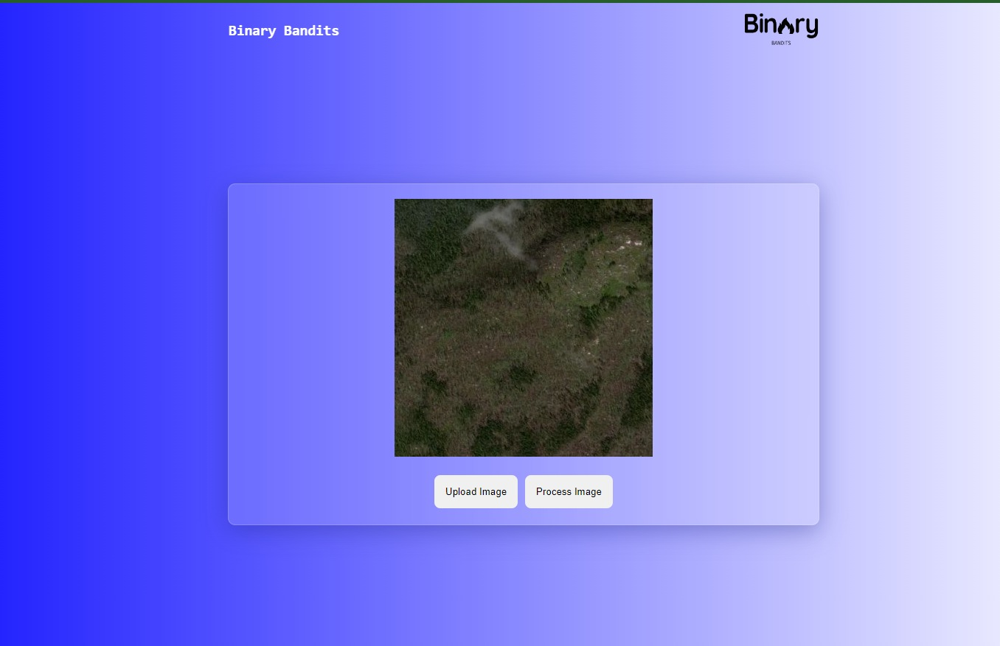
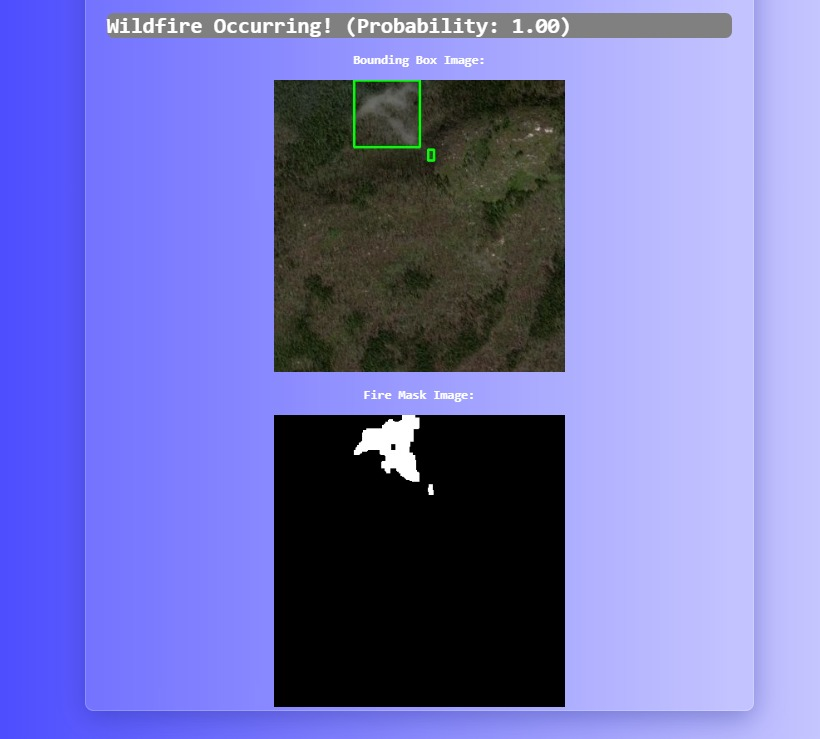

<!-- Improved compatibility of back to top link: See: https://github.com/othneildrew/Best-README-Template/pull/73 -->
<a id="readme-top"></a>
<!--
*** Thanks for checking out the Best-README-Template. If you have a suggestion
*** that would make this better, please fork the repo and create a pull request
*** or simply open an issue with the tag "enhancement".
*** Don't forget to give the project a star!
*** Thanks again! Now go create something AMAZING! :D
-->


<!-- PROJECT SHIELDS -->
<!--
*** I'm using markdown "reference style" links for readability.
*** Reference links are enclosed in brackets [ ] instead of parentheses ( ).
*** See the bottom of this document for the declaration of the reference variables
*** for contributors-url, forks-url, etc. This is an optional, concise syntax you may use.
*** https://www.markdownguide.org/basic-syntax/#reference-style-links
-->

<!-- PROJECT LOGO -->
<br />
<div align="center">
  <a href="https://github.com/github_username/repo_name">
    
  </a>

<h3 align="center">Wildfire Prediction Model</h3>

  <p align="center">
    project_description
    <br />
    <a href="https://github.com/Divyansh-0864/Wildfire-Prediction"><strong>Explore the docs »</strong></a>
    <br />
    <br />
    <a href="https://github.com/Divyansh-0864/Wildfire-Prediction">View Demo</a>
    ·
  </p>
</div>


<!-- TABLE OF CONTENTS -->
<details>
  <summary>Table of Contents</summary>
  <ol>
    <li>
      <a href="#about-the-project">About The Project</a>
      <ul>
        <li><a href="#built-with">Built With</a></li>
      </ul>
    </li>
    <li>
      <a href="#getting-started">Getting Started</a>
      <ul>
        <li><a href="#prerequisites">Prerequisites</a></li>
        <li><a href="#installation">Installation</a></li>
      </ul>
    </li>
    <li><a href="#usage">Usage</a></li>
  </ol>
</details>


<!-- ABOUT THE PROJECT -->
## About The Project

The Wildfire Detection Model is a machine learning-based solution designed to identify and locate wildfires in satellite images. Utilizing advanced techniques in computer vision and deep learning, this project aims to provide timely and accurate detection of wildfires, facilitating early intervention and prevention efforts. The model leverages a convolutional neural network (CNN) architecture, trained on a dataset of labeled satellite images, to detect fire-like regions with high accuracy.

<p align="right">(<a href="#readme-top">back to top</a>)</p>


### Built With
* Pandas
* Numpy
* OpenCV
* Tensorflow
* Keras
* Flask

<p align="right">(<a href="#readme-top">back to top</a>)</p>


<!-- GETTING STARTED -->
## Getting Started

Follow the instructions to run the code locally

### Installation

1. Install the dependencies
  ```sh
  pip install -r requirements.txt
  ```

2. Run the ```Model_Training.ipynb``` file to generate the keras models

3. Run the web-app
   ```
   python main.py
   ```

<p align="right">(<a href="#readme-top">back to top</a>)</p>


<!-- USAGE EXAMPLES -->
## Usage
Upload a satellite image from your system or use the test images in ```APP/TestImg/``` folder




<p align="right">(<a href="#readme-top">back to top</a>)</p>


<!-- CONTRIBUTING -->
<!-- ### Top contributors:

<a href="https://github.com/github_username/repo_name/graphs/contributors">
  
</a> -->


<!-- CONTACT -->
<!-- ## Contact

Your Name - [@LinkedIn_handle](https://twitter.com/twitter_handle) - email@email_client.com

Project Link: [https://github.com/github_username/repo_name](https://github.com/github_username/repo_name)

<p align="right">(<a href="#readme-top">back to top</a>)</p>
 -->
